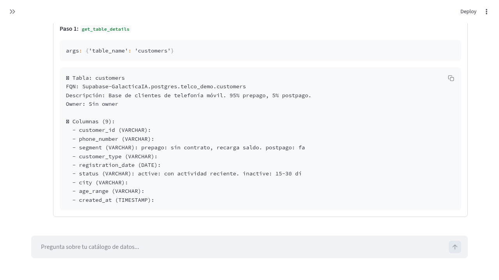

# OpenMetadata Agent

> A conversational AI assistant for your data catalog. Ask questions in natural language, get answers from OpenMetadata.


## The Problem

Data catalogs like OpenMetadata are powerful, but most business users never open them. They don't know the UI, they don't know where to look, and they definitely don't write API calls. The metadata stays locked behind a tool that only engineers use.

## The Solution

OpenMetadata Agent adds a **conversational layer** on top of OpenMetadata. Users ask questions in plain language and the agent queries the catalog automatically using MCP tools and Gemini's native function calling.

```
User: "What tables do we have related to customers?"
Agent: searches catalog → finds 3 tables → returns details with columns and descriptions
```

No need to learn the OpenMetadata UI. No need to write API calls. Just ask.

### See it in action

**Query the business glossary:**


**Find table owners:**


## Prerequisites

You need a running **OpenMetadata instance** (v1.3+) accessible via its REST API. The agent connects to it — it does not include or install OpenMetadata itself.

Options to get OpenMetadata running:
- **Docker** (recommended): Follow the [official Docker deployment guide](https://docs.open-metadata.org/deployment/docker)
- **Bare metal / Kubernetes**: See [OpenMetadata deployment docs](https://docs.open-metadata.org/deployment)
- **Sandbox**: Use the [OpenMetadata Sandbox](https://sandbox.open-metadata.org/) for testing

You also need a **Google Gemini API key** — get one free at [Google AI Studio](https://aistudio.google.com/apikey).

## Quick Start

```bash
git clone https://github.com/ronaldmego/openmetadata-mcp-agent.git
cd openmetadata-mcp-agent

cp .env.example .env
# Edit .env with your credentials (see Environment Variables below)

pip install -r requirements.txt

streamlit run app.py --server.port 4004
# Open http://localhost:4004
```

## Architecture

```
┌─────────────────┐     ┌─────────────────┐     ┌─────────────────┐
│   Streamlit     │────▶│   Agent         │────▶│  OpenMetadata   │
│   Chat UI       │     │   (Gemini LLM)  │     │  REST API       │
└─────────────────┘     └─────────────────┘     └─────────────────┘
        │                       │
        ▼                       ▼
   User                 27 MCP Tools
   (browser)            (17 read + 10 write)
```

## How It Works

1. User asks a question in the chat UI
2. Gemini analyzes the question and decides which MCP tool(s) to call
3. The agent executes the tool against the OpenMetadata REST API
4. Gemini receives the raw result and formats a human-readable answer
5. If the first tool doesn't return useful results, the agent retries with alternative strategies

No manual routing or keyword matching — Gemini's native function calling handles tool selection automatically.

Every tool call is visible in a debug expander below each response:



## Available Tools

### Read Tools (17)

| Tool | Description |
|------|-------------|
| `search_catalog` | Search assets by keyword |
| `list_tables` | List tables with optional database/schema filter |
| `get_table_details` | Full table details: columns, types, owner, tags |
| `get_lineage` | Upstream and downstream data lineage |
| `list_databases` | List all registered databases |
| `list_glossary_terms` | Business glossary terms and definitions |
| `list_domains` | Data domains and subdomains |
| `list_stored_procedures` | Stored procedures by schema |
| `list_policies` | Access policies and rule counts |
| `list_roles` | Roles with associated policies |
| `list_services` | Services by type (database, messaging, dashboard, pipeline, mlmodel, storage, search) |
| `list_pipelines` | Data pipelines and their services |
| `list_dashboards` | Dashboards and their services |
| `list_topics` | Kafka/messaging topics |
| `list_data_products` | Data products and their domains |
| `list_users` | Registered users |
| `list_teams` | Registered teams |

### Write Tools (10)

| Tool | Description |
|------|-------------|
| `update_table_description` | Update a table's description |
| `update_column_description` | Update a column's description |
| `assign_owner` | Assign a user or team as table owner |
| `create_glossary` | Create a new business glossary |
| `create_glossary_term` | Add a term to a glossary |
| `link_glossary_term` | Link a glossary term to a table |
| `create_classification` | Create a tag classification (category) |
| `create_tag` | Create a tag within a classification |
| `assign_tag` | Assign a tag to a table |
| `create_domain` | Create a data domain |

All write tools require **user confirmation** before execution. The agent shows exactly what will change and asks before proceeding.

### Safety Features

- **Dry-run mode** — Toggle in sidebar to preview write operations without applying changes
- **Audit log** — All write operations logged with timestamp, tool, args, and result in the sidebar
- **Confirmation prompt** — Agent always asks before executing any write operation

## Stack

| Component | Technology | Why |
|-----------|-----------|-----|
| **UI** | Streamlit | Fast prototyping, built-in chat components |
| **LLM** | Google Gemini 2.5 Pro | Native function calling, good reasoning |
| **Tools** | FastMCP | Standard MCP protocol for tool definitions |
| **Backend** | OpenMetadata REST API | Open-source data catalog |
| **Language** | Python 3.10+ | Ecosystem compatibility |

## Environment Variables

Copy `.env.example` to `.env` and fill in your values:

| Variable | Description | Required |
|----------|-------------|----------|
| `GOOGLE_API_KEY` | Gemini API key ([get one here](https://aistudio.google.com/apikey)) | Yes |
| `OPENMETADATA_URL` | Your OpenMetadata instance URL | Yes |
| `OPENMETADATA_TOKEN` | JWT token from OpenMetadata (Settings > Bots) | Yes |
| `GEMINI_MODEL` | Model to use (default: `gemini-2.5-pro`) | No |

## Project Structure

```
openmetadata-mcp-agent/
├── app.py              # Streamlit UI + agent (Gemini function calling)
├── server.py           # MCP tool definitions (OpenMetadata API) — 27 tools
├── .env.example        # Configuration template
├── requirements.txt    # Python dependencies
├── ROADMAP.md          # Development roadmap
├── CHANGELOG.md        # Version history
├── CONTRIBUTING.md     # Contribution guidelines
└── test_*.py           # Test scripts
```

## Testing

```bash
# Test OpenMetadata connection and MCP tools
python test_queries.py

# Test the full agent pipeline
python test_agent_gemini.py
```

## Conversation Examples

```
"What tables do we have?"                    → list_tables
"Show me the lineage of the orders table"    → get_lineage("orders")
"What columns does the customers table have?" → get_table_details("customers")
"Search everything related to sales"          → search_catalog("sales")
"What databases are registered?"              → list_databases
"Show me the business glossary"               → list_glossary_terms
"What data domains exist?"                    → list_domains
"What roles are configured?"                  → list_roles
"Show me the stored procedures"               → list_stored_procedures
"Update the customers table description"      → update_table_description (with confirmation)
"Assign admin as owner of the orders table"   → assign_owner (with confirmation)
"Create a glossary called 'business terms'"   → create_glossary (with confirmation)
```

## Roadmap

See [ROADMAP.md](./ROADMAP.md) for the full development plan.

This project is a **single-user MVP/POC** with complete API coverage (27 tools). It serves as the reusable foundation for a future enterprise edition with multi-user sessions, SSO authentication, and production deployment.

## Contributing

Contributions are welcome! Please open an issue first to discuss what you'd like to change.

## License

[MIT](./LICENSE)

---

Built by [Ronald Mego](https://ronaldmego.com)
